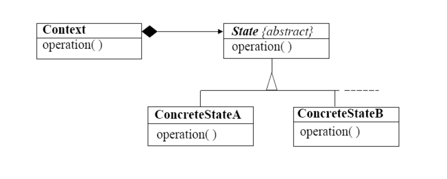

# Projeto prático/estudo de caso (PP)

Aluno: Vinicius Cavalcante Silva

Matricula: 202201673

**Nome do Padrão**

Padrão comportamental: State

**Problema:**

Um objeto exibe um comportamento diferente quando seu estado interno muda, fazendo o objeto parecer ter mudado a classe em tempo de execução.

**Contexto:**

Em algumas aplicações um objeto pode ter o comportamento complexo que seja dependente do seu estado. A resposta para uma mensagem.

**Solução:**

Separar o estado dependente do comportamento do objeto original e alocar este comportamento para um série de outros objetos, um para cada estado.

Estes objetos estado têm apenas responsabilidade relacionadas ao comportamento do respectivo estado.

**Diagrama de classes**



- **Context:** Define a interface de interesse para clientes. Mantém uma instância de uma subclasse ConcreteState que define o estado corrente
- **State:** define uma interface para encapsulamento do comportamento associado com um estado específico do Contexto
- **Subclasses ConcreteState:** Cada subclasse implementa um comportamento associado com um estado do contexto

**Classes e métodos no Java**


**Referências**

- [pec-12-patterns-intro.ppt (slideshare.net)](https://pt.slideshare.net/ssuser7025cf/pec12patternsintroppt?from_action=save)
- [State (refactoring.guru)](https://refactoring.guru/pt-br/design-patterns/state)

Exemplo de código

```java
class AudioPlayer is
    field state: State
    field UI, volume, playlist, currentSong

    constructor AudioPlayer() is
        this.state = new ReadyState(this)

        // O contexto delega o manuseio das entradas do usuário
        // para um objeto de estado. Naturalmente, o resultado
        // depende de qual estado está ativo, uma vez que cada
        // estado pode lidar com as entradas de forma diferente.
        UI = new UserInterface()
        UI.lockButton.onClick(this.clickLock)
        UI.playButton.onClick(this.clickPlay)
        UI.nextButton.onClick(this.clickNext)
        UI.prevButton.onClick(this.clickPrevious)

    // Outros objetos devem ser capazes de trocar o estado ativo
    // do tocador.
    method changeState(state: State) is
        this.state = state

    // Métodos de UI delegam a execução para o estado ativo.
    method clickLock() is
        state.clickLock()
    method clickPlay() is
        state.clickPlay()
    method clickNext() is
        state.clickNext()
    method clickPrevious() is
        state.clickPrevious()

    // Um estado pode chamar alguns métodos de serviço no
    // contexto.
    method startPlayback() is
        // ...
    method stopPlayback() is
        // ...
    method nextSong() is
        // ...
    method previousSong() is
        // ...
    method fastForward(time) is
        // ...
    method rewind(time) is
        // ...

// A classe de estado base declara métodos que todos os estados
// concretos devem implementar e também fornece uma referência
// anterior ao objeto de contexto associado com o estado.
// Estados podem usar a referência anterior para realizar a
// transição contexto para outro estado.
abstract class State is
    protected field player: AudioPlayer

    // O contexto passa a si mesmo através do construtor do
    // estado. Isso pode ajudar o estado a recuperar alguns
    // dados de contexto úteis se for necessário.
    constructor State(player) is
        this.player = player

    abstract method clickLock()
    abstract method clickPlay()
    abstract method clickNext()
    abstract method clickPrevious()

// Estados concretos implementam vários comportamentos
// associados com um estado do contexto.
class LockedState extends State is

    // Quando você desbloqueia um tocador bloqueado, ele vai
    // assumir um dos dois estados.
    method clickLock() is
        if (player.playing)
            player.changeState(new PlayingState(player))
        else
            player.changeState(new ReadyState(player))

    method clickPlay() is
        // Bloqueado, então não faz nada.

    method clickNext() is
        // Bloqueado, então não faz nada.

    method clickPrevious() is
        // Bloqueado, então não faz nada.

// Eles também podem ativar transições de estado no contexto.
class ReadyState extends State is
    method clickLock() is
        player.changeState(new LockedState(player))

    method clickPlay() is
        player.startPlayback()
        player.changeState(new PlayingState(player))

    method clickNext() is
        player.nextSong()

    method clickPrevious() is
        player.previousSong()

class PlayingState extends State is
    method clickLock() is
        player.changeState(new LockedState(player))

    method clickPlay() is
        player.stopPlayback()
        player.changeState(new ReadyState(player))

    method clickNext() is
        if (event.doubleclick)
            player.nextSong()
        else
            player.fastForward(5)

    method clickPrevious() is
        if (event.doubleclick)
            player.previous()
        else
            player.rewind(5)
```

Explicação do código apresentado

A classe AudioPlayer age como um contexto. Ela também mantém uma referência para uma instância de uma das classes de estado que representa o atual estado do tocador de áudio.

O contexto delega o manuseio das entradas do usuário para um objeto de estado. Naturalmente, o resultado depende de qual estado está ativo, uma vez que cada estado pode lidar com as entradas de forma diferente.

Outros objetos devem ser capazes de trocar o estado ativo do tocador.

Métodos de UI delegam a execução para o estado ativo.

Um estado pode chamar alguns métodos de serviço no contexto.

A classe de estado base declara métodos que todos os estados concretos devem implementar e também fornece uma referência anterior ao objeto de contexto associado com o estado. Estados podem usar a referência anterior para realizar a transição contexto para outro estado.

O contexto passa a si mesmo através do construtor do estado. Isso pode ajudar o estado a recuperar alguns dados de contexto úteis se for necessário.

Estados concretos implementam vários comportamentos associados com um estado do contexto.

Quando você desbloqueia um tocador bloqueado, ele vai assumir um dos dois estados.

Eles também podem ativar transições de estado no contexto.